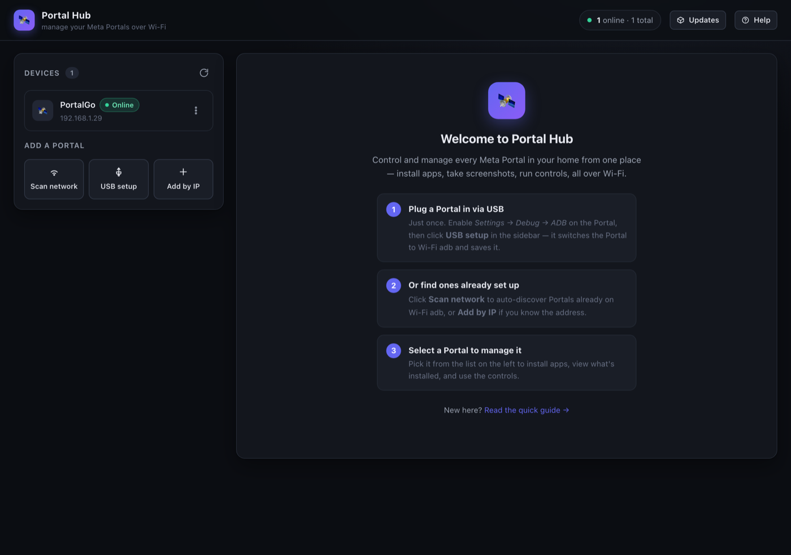
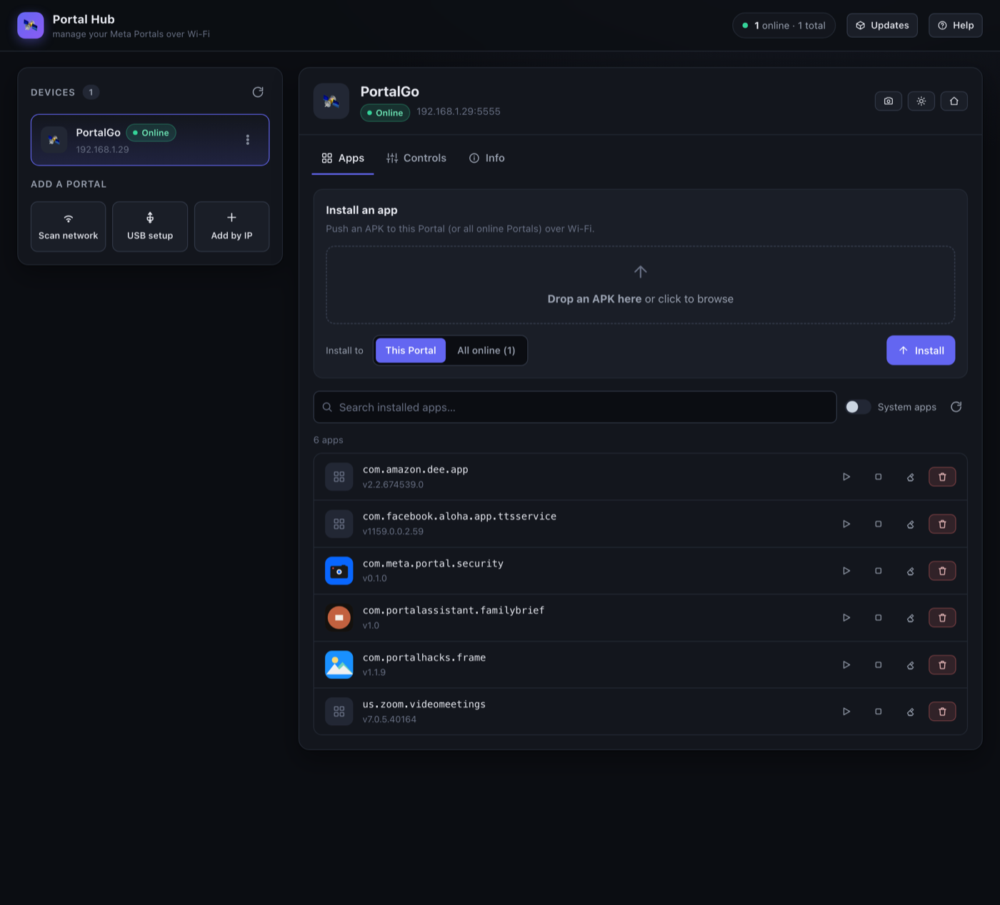
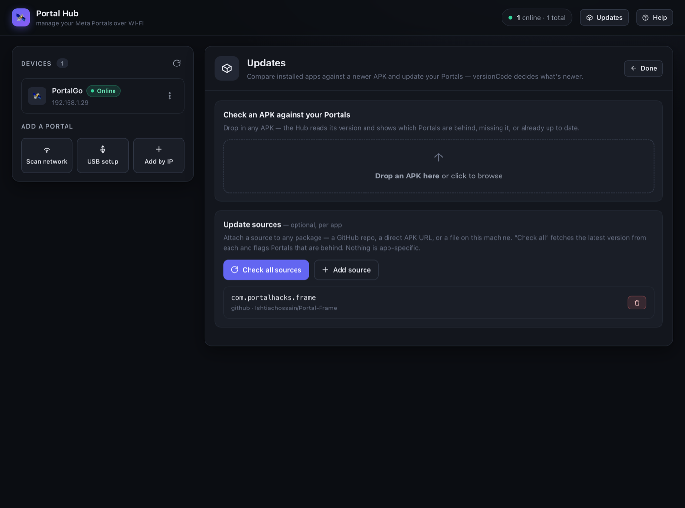

# Portal Hub

Control all your **Meta Portal** devices from one web page — over Wi‑Fi, with no cable needed each
time. Install apps, see what's installed, take screenshots, reboot, run commands, and keep apps up
to date across every Portal in your home.



## What it can do

- See every Portal and whether it's **online**.
- **Install** an app (APK) to one Portal — or all of them at once.
- See installed apps (with their icons) and **uninstall / open / force‑stop / clear** them.
- Take a **screenshot**, **reboot**, press **Home / Back / Wake / Sleep**, or run a **command**.
- **Check for newer versions** of an app and update the Portals that are behind.

## What you need

- A computer (Mac, Windows, or Linux) on the **same Wi‑Fi** as your Portals.
- **Python 3.7+** — already on most Macs and Linux. (Windows: get it from [python.org](https://www.python.org/downloads/).)
- **adb** — Android's "platform‑tools". One small download, and the *only* requirement:
  - **macOS:** `brew install android-platform-tools`
  - **Windows:** `winget install Google.PlatformTools`
  - **Linux:** `sudo apt install adb` (or your distro's package)

No accounts, no app store, nothing else — no `pip`, no `npm`.

## Start it

1. **Get the project:** click **Code → Download ZIP** above and unzip it (or `git clone` it).
2. **Run it** — open a terminal in the folder and type:
   ```bash
   python3 server.py
   ```
3. It prints a web address like `http://192.168.1.16:8080`. **Open that in a browser** — on this
   computer, or on your phone/laptop on the same Wi‑Fi. You'll see the welcome screen above.

## Add your first Portal (one time per Portal)

Portals are older Android devices, so the very first connection needs a USB cable once. After that
it's all wireless.

1. On the Portal, open **Settings → Debug → ADB** and turn it on.
2. Plug the Portal into your computer with a **USB‑C cable**.
3. In Portal Hub, click **USB setup** (left side). It finds the Portal, switches it to Wi‑Fi adb, and
   saves it. A box may pop up *on the Portal* asking to allow your computer — tap **Allow**.
4. **Unplug the cable.** The Portal now shows as **Online** and is ready to use over Wi‑Fi.

Repeat for each Portal. Set one up before? Click **Scan network** to find it automatically, or
**Add by IP** if you know its address.

> 💡 **Tip:** in your router settings, give each Portal a fixed ("reserved") IP so it never changes.

## Using it

Click a Portal on the left to manage it.

### Apps

Install an APK (to this Portal or all online Portals at once), and manage what's already installed —
open, force‑stop, clear data, or uninstall.



### Controls

Take a **screenshot**, **reboot** the Portal, press **Home / Back / Wake / Sleep**, or run any
`adb shell` command from the built‑in box.

### Updates

Check whether your apps have a newer version, and update the Portals that are behind. Point an app
at a **GitHub repo** or an **APK link**, click **Check all sources**, and update with one click. It
also **warns you** if an update is signed with a different key than what's installed (something
Android would otherwise reject).



## Good to know

- **After a Portal reboots,** its wireless connection turns off (an Android 9/10 limitation). Just do
  **USB setup** once more to bring it back.
- **Keep it on your home network.** Portal Hub has no password and can control your devices — don't
  expose it to the internet or to untrusted Wi‑Fi.
- Your saved Portals and update sources are stored locally (`devices.json`, `sources.json`) and are
  never shared.

## Options (optional)

Set these when starting, e.g. `PORT=9000 python3 server.py`:

- `PORT` — web port (default `8080`)
- `ADB` — full path to `adb` if it isn't on your `PATH`
- `HOST` — address to bind (default `0.0.0.0`, so other devices on your Wi‑Fi can reach it)
- `DEBUG_APK` — path to an APK you rebuild often, to get a one‑click "use latest build" option

## Having trouble?

- **Portal won't show up?** Make sure ADB is on, the cable is connected for **USB setup**, and you
  tapped **Allow** on the Portal when prompted.
- **"adb not found"?** Install platform‑tools (see *What you need*), or start with
  `ADB=/full/path/to/adb python3 server.py`.
- **Can't open the page from another device?** Both must be on the **same Wi‑Fi**, and the network
  must let devices talk to each other (turn off "client isolation" / "AP isolation" on guest Wi‑Fi).

---

*Developers: see [`CLAUDE.md`](CLAUDE.md) for the architecture and the zero‑dependency design.*
